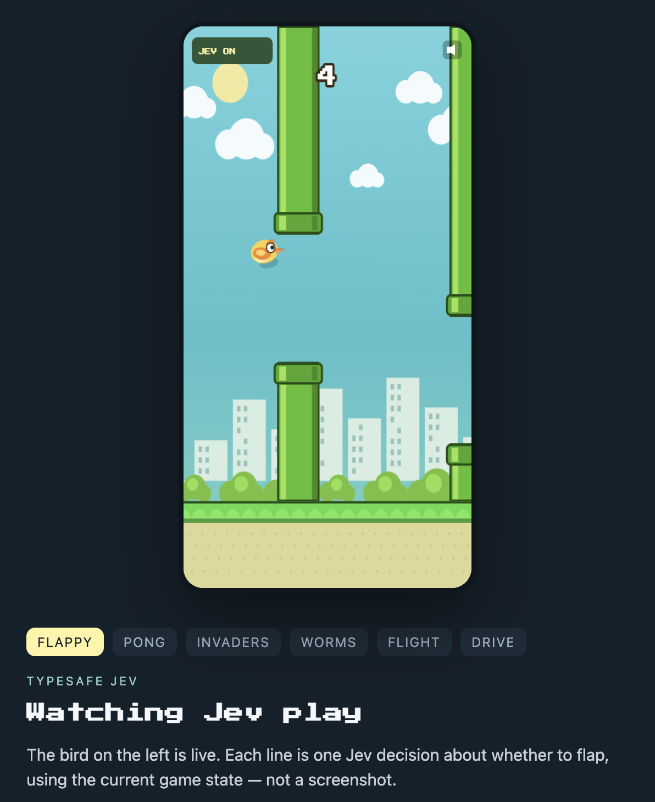
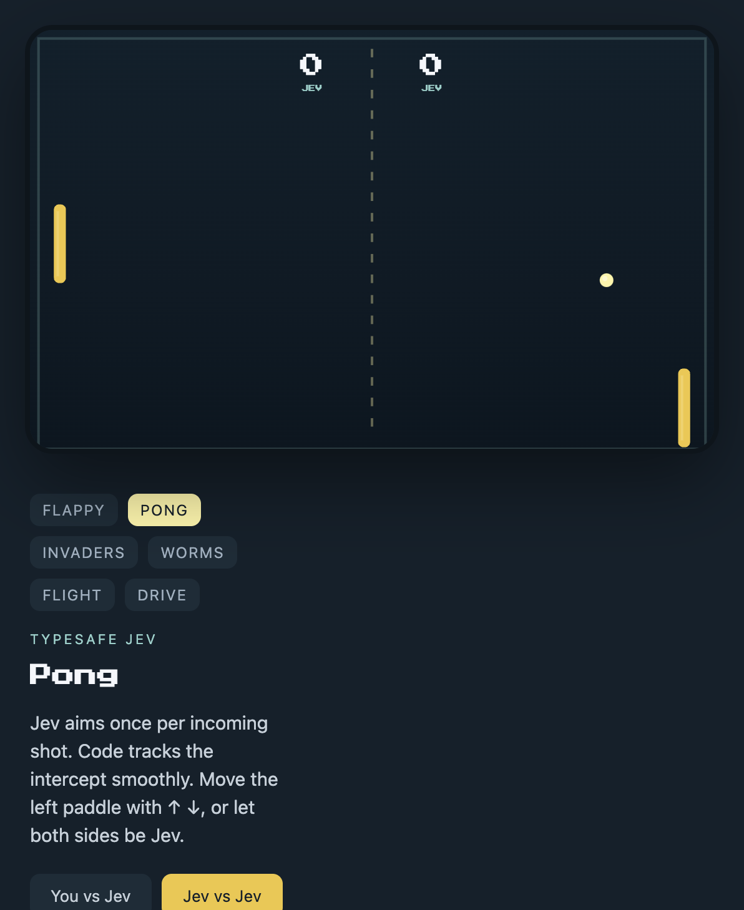
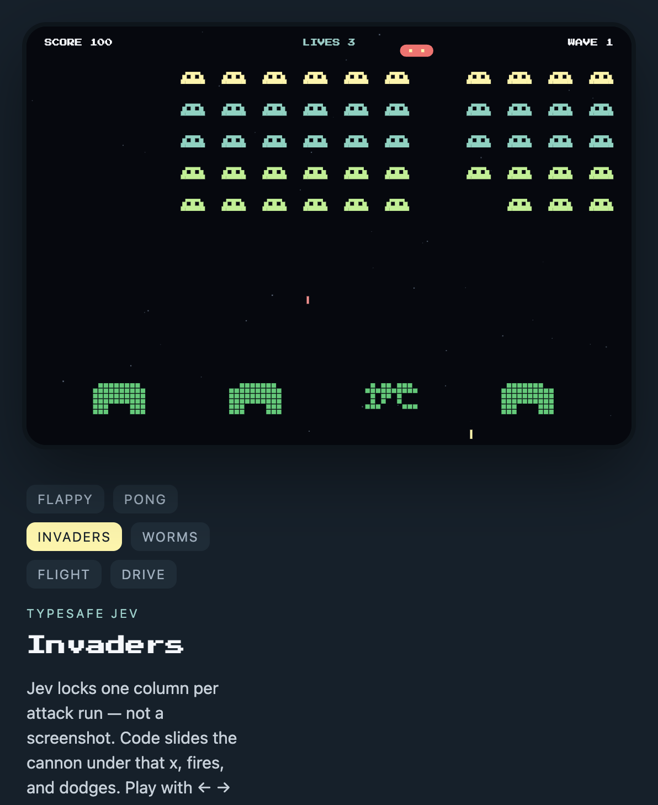
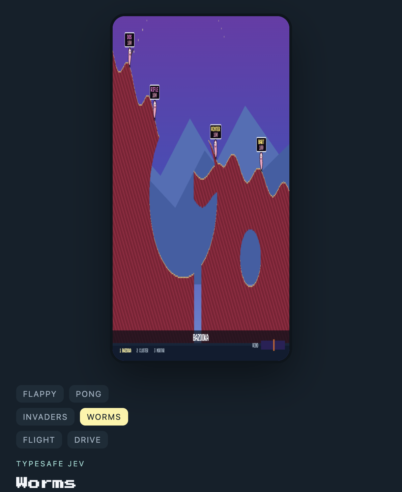
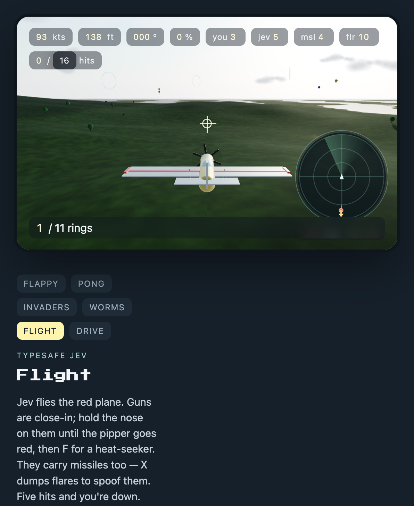
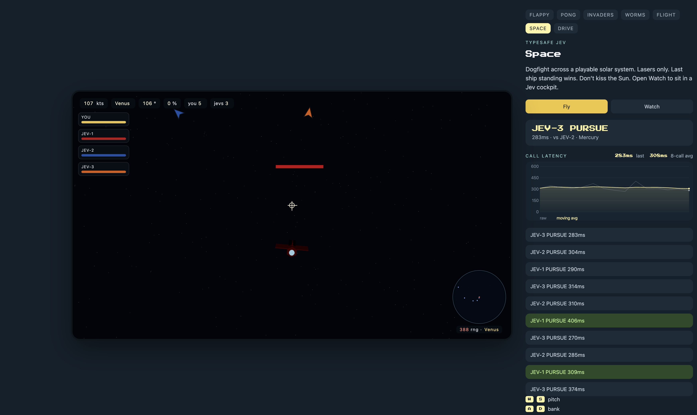
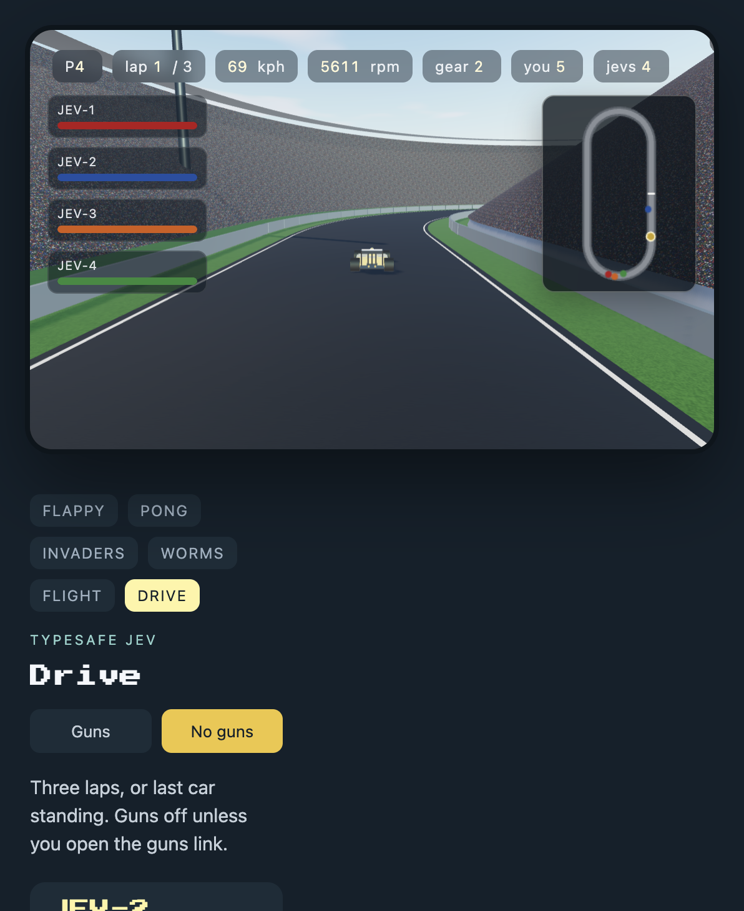

# Jev Games

Arcade games piloted by [TypeSafe](https://typesafe.ai) Jev (`jev-latest` via SystemOne). Bun serves the static pages and proxies each game’s `/api/*` calls.

<p>
  
  
</p>
<p>
  
  
</p>
<p>
  
  
</p>
<p>
  
</p>

## Prerequisites

- [Bun](https://bun.sh) 1.1+
- A TypeSafe API key with SystemOne access

## Setup

```bash
git clone https://github.com/studee/jev-games.git
cd jev-games
bun install
```

Create a `.env` in the repo root (Bun loads it automatically):

```bash
JEV_API_KEY=tsk_...
```

`TYPESAFE_API_KEY` is accepted as an alias. Without a key, pages still load but Jev routes return `500` (`JEV_API_KEY is not set`).

Optional:

| Variable | Default | Meaning |
| --- | --- | --- |
| `JEV_API_KEY` | — | Bearer token for `https://api.typesafe.ai/v1/systemone` |
| `TYPESAFE_API_KEY` | — | Same as `JEV_API_KEY` if that is unset |
| `PORT` | `8765` | HTTP port (bound to `127.0.0.1`) |

Do not commit `.env`.

## Run

```bash
bun run dev
```

That builds the browser bundles, then starts `src/server.ts` with `--watch`. For a one-shot build + serve (no watch):

```bash
bun run start
```

Open **http://127.0.0.1:8765/**.

| Path | Game |
| --- | --- |
| `/` | Flappy |
| `/pong.html` | Pong |
| `/invaders.html` | Invaders |
| `/worms.html` | Worms |
| `/worms.html?mode=you-vs-you` | Worms, two players (no Jev) |
| `/flight.html` | Flight |
| `/space.html` | Space |
| `/space.html?mode=watch` | Space, watch Jevs |
| `/drive.html` | Drive (no guns) |
| `/drive.html?guns=1` | Drive with guns |

Mode rows are query-string links (`?mode=`, `?weapon=`, `?level=`).

`public/game.js`, `pong.js`, `flight.js`, `space.js`, and `drive.js` are generated; `bun run build` writes them. `bun run typecheck` runs `tsc --noEmit`.
